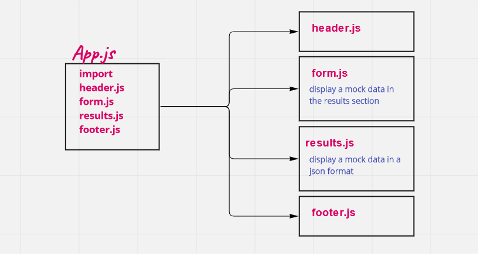

# resty

Is an convert for the resty class component website, we used functional component instead of class and I used scss and react bootstrap to design it.

Our application will be an API testing tool that can be run in any browser, allowing a user to easily interact with APIs in a familiar interface.

resource : [resty-Api](https://resty.netlify.app/)

[PR link](https://github.com/salammustafa728/resty/pull/1)

[deploy link](https://resty-api-salam.netlify.app/)

lab #27

[PR link](https://github.com/salammustafa728/resty/pull/4)

lab #28 

[PR link](https://github.com/salammustafa728/resty/pull/7)

# Uml

